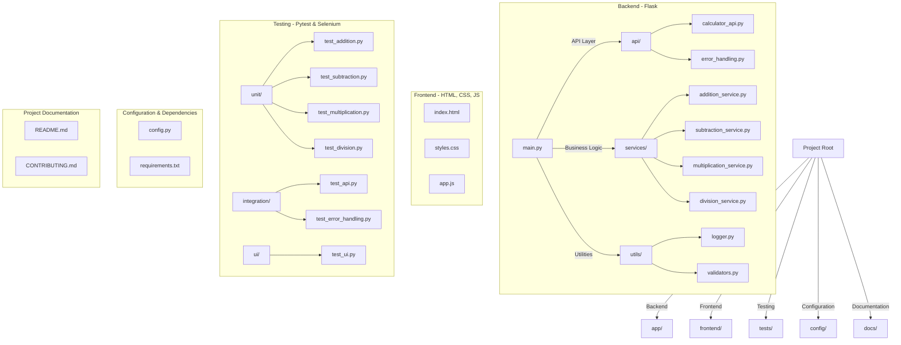
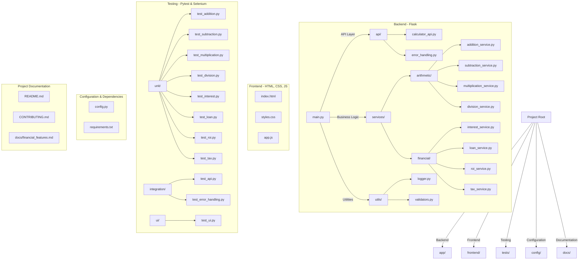
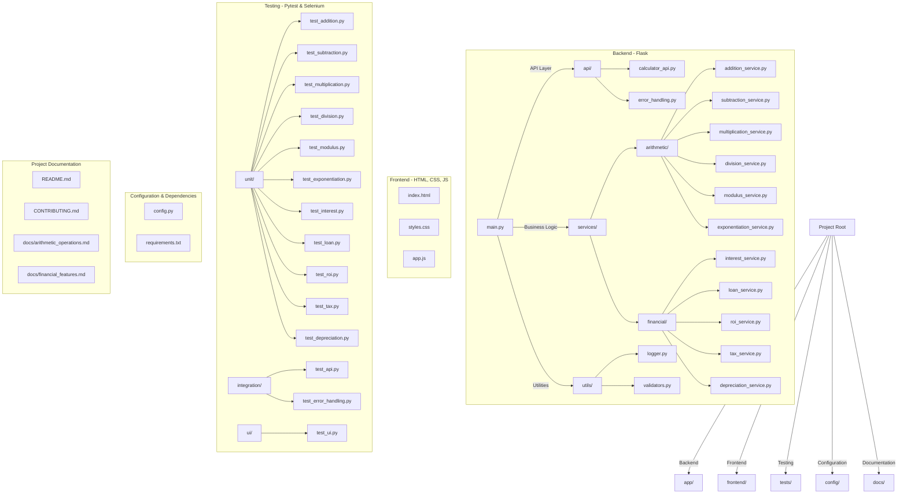

## First Prompt

Create a planning document for a python calculator web application that will be a collaborative project and must meet the design and SOLID principles. It should allow for a team of 3 - 6 members who will be using GitHub for version control. We will add features in future sprints but for now will just address the fundamental calculation addition, substraction, multiplication and division.


---

# **Python Calculator Web Application - Planning Document**  

## **1. Project Overview**  
The Python Calculator Web Application is a collaborative project designed to provide basic arithmetic operations via a web-based interface. The initial development phase will focus on implementing fundamental calculations: addition, subtraction, multiplication, and division. Future sprints will introduce advanced features.  

## **2. Team Structure**  
- **Team Size:** 3 - 6 members  
- **Roles & Responsibilities:**  
  - **Project Manager:** Oversees progress, ensures deadlines are met, and facilitates communication.  
  - **Backend Developer(s):** Implements the logic for calculations and API endpoints.  
  - **Frontend Developer(s):** Designs the user interface and integrates it with the backend.  
  - **QA Engineer(s):** Develops test cases and performs unit, integration, and UI testing.  
  - **DevOps Engineer (optional):** Manages deployment and CI/CD pipelines.  

## **3. Development & Design Principles**  
The project will adhere to software engineering best practices, including:  
- **SOLID Principles** for maintainability and scalability.  
- **Separation of Concerns (SoC):** Clear division between backend logic, UI, and database (if introduced).  
- **Modular Design:** Ensures easy expansion of features.  
- **Error Handling & Logging:** Implements structured exception handling and logs important system events.  
- **Testability:** Code will be designed to be easily testable using unit and integration tests.  

## **4. Technology Stack**  
- **Backend:** Python with Flask  
- **Frontend:** HTML, CSS, JavaScript (optional for future enhancements)  
- **Testing:** Pytest for unit tests, Selenium for UI testing (future feature)  
- **Version Control:** GitHub for collaborative development  
- **Deployment:** Local development (future cloud deployment planned)  

## **5. Features (Sprint 1 - Core Functionality)**  
The initial release will include:  
✅ User interface for inputting numbers and selecting operations  
✅ Backend logic for performing:  
   - Addition  
   - Subtraction  
   - Multiplication  
   - Division (handling divide-by-zero errors)  
✅ Simple API endpoints for calculations (optional)  
✅ Unit tests for core functionality  

## **6. Future Sprint Roadmap (Planned Enhancements)**  
🔹 **Sprint 2:** User authentication & session management  
🔹 **Sprint 3:** Advanced calculations (exponents, square root, etc.)  
🔹 **Sprint 4:** History of calculations  
🔹 **Sprint 5:** Mobile responsiveness & UI improvements  
🔹 **Sprint 6:** Cloud deployment  

## **7. Collaboration & Workflow**  
- **Version Control:** GitHub repository with feature branches  
- **Branching Strategy:**  
  - `main` (stable version)  
  - `dev` (integration branch)  
  - Feature branches (e.g., `feature/addition`)  
- **Code Reviews:** Pull requests with peer reviews before merging  
- **Task Management:** GitHub Issues & Projects  
- **Communication Tools:** Slack/Discord for team discussions  

## **8. Testing Strategy**  
- **Unit Tests:** Pytest for core logic validation  
- **Integration Tests:** API endpoint tests  
- **UI Testing:** Selenium (future enhancement)  
- **CI/CD:** GitHub Actions for automated testing and deployment (future consideration)  

## **9. Risk Management & Mitigation**  
| Risk | Mitigation Strategy |  
|------|---------------------|  
| Scope creep | Define feature sets for each sprint and stick to them |  
| Merge conflicts | Follow structured Git branching and commit regularly |  
| Deployment issues | Use local testing before cloud deployment |  
| Lack of testing | Enforce test-driven development (TDD) |  

## **10. Timeline & Milestones**  
- **Week 1:** Project setup, GitHub repository creation, initial planning  
- **Week 2:** Backend logic for core calculations  
- **Week 3:** Basic frontend integration  
- **Week 4:** Testing, debugging, and documentation  

---


## Second Prompt


The project will have parallel testing and should be structured to allow multiple programmers while adhering to the desing and SOLID principles. What specifically should happen. Create a recommended specific structure diagram using mermaid that will allow features to be added with minimum conflict and allow for testing. 

---

### **🔹 What Specifically Should Happen?**
To **enable parallel development and testing**, the project must:  
1. **Follow a Modular Structure**  
   - Separate each feature (calculation operation) into independent **service modules**.  
   - Use an **API layer** to interact with the frontend.  
   - Isolate utilities (e.g., logging, error handling) to **reduce dependencies**.  

2. **Enable Multiple Programmers**  
   - Each team member should **work on independent modules** to prevent conflicts.  
   - Backend developers can work on different **services (`addition_service.py`, `division_service.py`, etc.)**.  
   - Frontend and backend integration happens via the API (`calculator_api.py`).  

3. **Support Parallel Testing**  
   - **Unit Tests**: Each service has dedicated unit tests (`test_addition.py`, etc.).  
   - **Integration Tests**: API endpoints are tested in **parallel**.  
   - **UI Tests**: Separate test cases for frontend elements.  

---

### **📂 Recommended Project Structure (Mermaid Diagram)**




### **🔹 How This Structure Supports Parallel Testing & Multiple Developers**
✅ **Minimized Merge Conflicts**  
- **Feature Isolation**: Developers work on separate files (`addition_service.py`, `test_addition.py`, etc.).  
- **Modular Design**: Each operation is independent, reducing code coupling.  

✅ **Parallel Testing**  
- **Unit tests (`tests/unit/`)**: Run independently for each service.  
- **Integration tests (`tests/integration/`)**: Validate API endpoints.  
- **UI tests (`tests/ui/`)**: Ensure frontend interactions work as expected.  

✅ **SOLID Principles in Action**  
- **Single Responsibility (SRP)**: Each file has a distinct role.  
- **Open/Closed Principle (OCP)**: New operations (e.g., exponentiation) can be **added without modifying existing code**.  
- **Liskov Substitution (LSP)**: Services follow a standard interface for extensibility.  

---

## Third Prompt


How should the project and github folders be structured to meet the above.

---

To align with the proposed **modular structure, parallel testing, and SOLID principles**, the **GitHub repository** and **project directory** should follow this well-organized structure:

---

### **📂 GitHub Repository Structure**
```
python-calculator-app/  
│── app/                     # Backend application  
│   ├── api/                 # API layer  
│   │   ├── calculator_api.py  
│   │   ├── error_handling.py  
│   ├── services/            # Business logic (each operation separate)  
│   │   ├── addition_service.py  
│   │   ├── subtraction_service.py  
│   │   ├── multiplication_service.py  
│   │   ├── division_service.py  
│   ├── models/              # Future-proof for database integration  
│   │   ├── calculation.py  
│   ├── utils/               # Utility functions  
│   │   ├── logger.py  
│   ├── main.py              # Application entry point  
│── frontend/                 # Frontend (HTML, CSS, JS)  
│   ├── index.html  
│   ├── styles.css  
│   ├── app.js  
│── tests/                    # Testing  
│   ├── unit/                 # Unit tests for each service  
│   │   ├── test_addition.py  
│   │   ├── test_subtraction.py  
│   │   ├── test_multiplication.py  
│   │   ├── test_division.py  
│   ├── integration/          # API and system integration tests  
│   │   ├── test_api.py  
│   │   ├── test_error_handling.py  
│   ├── ui/                   # UI Testing (Selenium, Playwright)  
│   │   ├── test_ui.py  
│── config/                   # Configuration files  
│   ├── config.py  
│   ├── requirements.txt  
│── docs/                     # Documentation  
│   ├── README.md  
│   ├── CONTRIBUTING.md  
│── .github/                   # GitHub Workflow (CI/CD & Issues)  
│   ├── workflows/  
│   │   ├── ci.yml            # Automated testing workflow  
│── .gitignore                 # Ignore unnecessary files  
│── LICENSE                    # Open-source license  
│── setup.py                    # Optional: Package setup  
```

---

### **💡 Why This Structure?**
✅ **Parallel Development:**  
- **Feature isolation:** Each operation has its own module (`services/`), minimizing conflicts.  
- **Separate API layer:** The `api/` folder allows independent work on request handling.  
- **Dedicated tests:** Multiple programmers can work in `tests/` without interfering.  

✅ **Modular Design (SOLID Principles)**  
- **Single Responsibility Principle (SRP):** Each file focuses on one responsibility.  
- **Open/Closed Principle (OCP):** New operations can be added without modifying the core structure.  
- **Dependency Inversion Principle (DIP):** Services interact with interfaces instead of hardcoded dependencies.  

✅ **Testing Strategy & CI/CD**  
- **Unit Tests (`tests/unit/`)** ensure each calculation function works.  
- **Integration Tests (`tests/integration/`)** verify API behavior.  
- **UI Tests (`tests/ui/`)** simulate user interaction.  
- **GitHub Actions Workflow (`.github/workflows/ci.yml`)** automates test execution.  

---

### **🔀 GitHub Workflow & Collaboration Guidelines**
1. **Branching Strategy** (Minimizing Merge Conflicts)  
   - `main` → Stable production branch  
   - `dev` → Integration branch for testing  
   - `feature/addition`, `feature/multiplication`, etc. → Developers work on isolated feature branches  
   - **Pull Requests (PRs)** → Code must pass tests before merging into `dev`  

2. **GitHub Issues & Project Board**  
   - **Issue Tracking:** Each task (e.g., "Implement division logic") is assigned as an issue.  
   - **GitHub Projects:** A Kanban board organizes tasks by `To Do`, `In Progress`, and `Done`.
     

3. **Automated Testing & CI/CD**  
   - **GitHub Actions** (`.github/workflows/ci.yml`) runs unit tests on each PR.  
   - Prevents merging broken code into `dev` or `main`.  

---


## Fourth prompt

Add a stub for future features for a financial calculator

---

### **📂 Updated Project Structure (with Financial Calculator Stub)**


---

### **🔹 How This Supports Future Growth**
✅ **"Stubbed" Financial Calculator (`services/financial/`)**  
- Placeholder services (`interest_service.py`, `loan_service.py`, etc.) allow future expansion.  
- No conflict with arithmetic calculations, maintaining **Separation of Concerns (SoC)**.  

✅ **Testing Scalability (`tests/unit/financial/`)**  
- **Unit tests for financial calculations** are separate from arithmetic tests.  
- **Financial API testing can be parallelized** in `tests/integration/`.  

✅ **Future Documentation (`docs/financial_features.md`)**  
- A placeholder file for documentation on **financial formulas and usage**.  

---


## Fifth Prompt


make sure the oprations is also added above

---

### **📂 Updated Project Structure with Arithmetic & Financial Operations**


---

### **🔹 Key Features & Benefits**
✅ **Explicit Arithmetic Operations**
- Clear separation of **basic operations** (`addition_service.py`, `subtraction_service.py`, etc.).
- Additional math functions like **modulus (`%`)** and **exponentiation (`^`)** included.
- Ensures **future extensibility** (e.g., logarithms, trigonometry, matrices).

✅ **Future-Ready Financial Calculator**
- New **financial services directory (`services/financial/`)** allows **gradual feature integration**.
- Predefined files for **interest calculations, loans, taxes, and depreciation**.
- **Scalable testing (`tests/unit/financial/`)** keeps financial features **isolated** from arithmetic.

✅ **Parallel Testing & Team Collaboration**
- Each operation has **its own test file** (`test_addition.py`, `test_interest.py`, etc.).
- **Unit, Integration, and UI testing are separate**, making it easier for teams to work in parallel.
- Supports **GitHub CI/CD automation** for **continuous testing**.

✅ **Comprehensive Documentation**
- `docs/arithmetic_operations.md`: Explains math operations.
- `docs/financial_features.md`: Placeholder for future financial formulas.
- `README.md` and `CONTRIBUTING.md`: For **team collaboration & best practices**.

---


## Sixth Prompt

create a draft test plan for the above with recommended test cases

---

Here's a **draft test plan** for the **Python Calculator Web Application** that aligns with **parallel testing, modular design, and SOLID principles**. It includes **unit, integration, and UI test cases** for **arithmetic and financial operations**.  

---

# **📜 Test Plan: Python Calculator Web Application**  
**Version:** 1.0  
**Date:** [Insert Date]  
**Prepared By:** [Your Name]  
**Project:** Python Calculator Web Application  
**Scope:** Fundamental arithmetic operations + future financial calculator features  

---

## **1️⃣ Test Objectives**  
- Ensure all calculator operations **function correctly**.  
- Validate that the API and UI work **as expected**.  
- Ensure **scalability** for future financial features.  
- Maintain **parallel testing** and **minimal merge conflicts**.  

---

## **2️⃣ Testing Scope & Approach**  

### **📌 2.1 Functional Testing**
✅ **Unit Testing (Pytest)**  
- Test each arithmetic operation independently.  
- Ensure future financial modules work correctly.  

✅ **Integration Testing (Pytest + Requests)**  
- Validate API responses for calculations.  
- Test error handling and edge cases.  

✅ **UI Testing (Selenium & Playwright)**  
- Verify calculator UI interactions (button clicks, input validation).  
- Ensure proper data entry, display, and formatting.  

---

## **3️⃣ Test Environment**  
| Component  | Technology |
|------------|------------|
| Backend   | Flask, Python |
| Frontend  | HTML, CSS, JavaScript |
| API Testing | Postman, Pytest, Requests |
| UI Testing | Selenium, Playwright |
| Version Control | GitHub |
| Database (if needed) | SQLite/PostgreSQL (Future) |

---

## **4️⃣ Test Cases**  

### **🧪 4.1 Unit Test Cases (tests/unit/)**
| Test Case ID | Test Scenario | Expected Outcome |
|-------------|--------------|-----------------|
| UT-001 | Add two positive numbers | Correct sum returned |
| UT-002 | Subtract two numbers | Correct difference returned |
| UT-003 | Multiply two numbers | Correct product returned |
| UT-004 | Divide two numbers | Correct quotient returned |
| UT-005 | Division by zero | Returns error message |
| UT-006 | Modulus operation | Returns correct remainder |
| UT-007 | Exponentiation | Returns correct power result |
| UT-008 | Validate input (non-numeric) | Returns validation error |

---

### **🔗 4.2 Integration Test Cases (tests/integration/)**
| Test Case ID | Test Scenario | Expected Outcome |
|-------------|--------------|-----------------|
| IT-001 | Call API to add numbers | Returns correct sum |
| IT-002 | Call API with missing parameters | Returns error message |
| IT-003 | Validate API error handling | Returns HTTP 400/500 status |
| IT-004 | Check API response format | Returns JSON response |

---

### **🎭 4.3 UI Test Cases (tests/ui/)**
| Test Case ID | Test Scenario | Expected Outcome |
|-------------|--------------|-----------------|
| UI-001 | Click buttons for addition | Correct result displayed |
| UI-002 | Enter invalid input (text) | Shows error message |
| UI-003 | Ensure mobile responsiveness | UI adjusts properly |
| UI-004 | Test button clicks for operations | Buttons work correctly |

---

### **💰 4.4 Future Financial Test Cases (tests/unit/financial/)**
| Test Case ID | Test Scenario | Expected Outcome |
|-------------|--------------|-----------------|
| FT-001 | Calculate simple interest | Correct interest returned |
| FT-002 | Calculate compound interest | Correct result returned |
| FT-003 | Validate loan repayment formula | Correct EMI returned |
| FT-004 | ROI calculation | Correct ROI returned |
| FT-005 | Tax calculation with different rates | Correct tax value |

---

## **5️⃣ Test Execution & Reporting**  
✅ **Parallel Test Execution**  
- Run **unit tests in parallel** using `pytest -n auto`.  
- UI and API tests are **separate workflows** to prevent delays.  

✅ **Automated Testing with GitHub Actions**  
- All **pushes & pull requests trigger tests**.  
- Failures prevent merging to `main`.  

✅ **Test Reporting**  
- Use `pytest-html` for test reports.  
- Track test case execution using GitHub Issues.  

---

## **6️⃣ Risk & Mitigation**
| Risk | Impact | Mitigation Strategy |
|------|--------|----------------------|
| Merge Conflicts | Medium | Modular structure, feature branches |
| API Downtime | High | Mock API for testing |
| UI Compatibility Issues | Medium | Browser testing via Playwright |

---

## **7️⃣ Sign-Off**  
**Approved By:** [Team Lead Name]  
**Date:** [Insert Date]  

---

## Seventh Prompt

your choice - "Integrate this into a github ci/co pipeline"

---

To integrate the **test plan into a GitHub CI/CD pipeline**, we'll set up **GitHub Actions** to automate testing for **unit, integration, and UI tests**.  

---

## **📌 Steps to Implement GitHub CI/CD for the Calculator App**
1. **Create a `.github/workflows/ci.yml` file** in your repository.  
2. **Define multiple jobs**:
   - **Unit Tests** (`pytest`)  
   - **Integration Tests** (`pytest` with API calls)  
   - **UI Tests** (`Selenium & Playwright`)  
3. **Run tests in parallel** to minimize execution time.  
4. **Generate reports** and fail builds if tests fail.  

---

### **📄 GitHub Actions Workflow: `.github/workflows/ci.yml`**
```yaml
name: Python Calculator CI Pipeline

on:
  push:
    branches:
      - main
      - develop
  pull_request:
    branches:
      - main

jobs:
  # ✅ Unit Tests
  unit_tests:
    runs-on: ubuntu-latest
    steps:
      - name: Checkout Repository
        uses: actions/checkout@v4

      - name: Set up Python
        uses: actions/setup-python@v4
        with:
          python-version: '3.10'

      - name: Install Dependencies
        run: |
          pip install -r requirements.txt
          pip install pytest pytest-cov

      - name: Run Unit Tests
        run: pytest tests/unit --cov=app --cov-report=xml

      - name: Upload Coverage Report
        uses: actions/upload-artifact@v4
        with:
          name: coverage-report
          path: coverage.xml

  # 🔗 Integration Tests
  integration_tests:
    runs-on: ubuntu-latest
    needs: unit_tests  # Ensure unit tests pass first
    steps:
      - name: Checkout Repository
        uses: actions/checkout@v4

      - name: Set up Python
        uses: actions/setup-python@v4
        with:
          python-version: '3.10'

      - name: Install Dependencies
        run: |
          pip install -r requirements.txt
          pip install pytest requests

      - name: Start Flask Server in Background
        run: |
          python app/main.py &
          sleep 5  # Give time for server to start

      - name: Run Integration Tests
        run: pytest tests/integration

  # 🎭 UI Tests (Selenium & Playwright)
  ui_tests:
    runs-on: ubuntu-latest
    needs: integration_tests  # Ensure integration tests pass first
    steps:
      - name: Checkout Repository
        uses: actions/checkout@v4

      - name: Set up Python
        uses: actions/setup-python@v4
        with:
          python-version: '3.10'

      - name: Install Dependencies
        run: |
          pip install -r requirements.txt
          pip install selenium playwright pytest-playwright

      - name: Install Playwright Browsers
        run: playwright install

      - name: Run UI Tests
        run: pytest tests/ui

  # ✅ Financial Calculator Future Tests
  future_financial_tests:
    runs-on: ubuntu-latest
    needs: unit_tests
    steps:
      - name: Checkout Repository
        uses: actions/checkout@v4

      - name: Set up Python
        uses: actions/setup-python@v4
        with:
          python-version: '3.10'

      - name: Install Dependencies
        run: |
          pip install -r requirements.txt
          pip install pytest pytest-cov

      - name: Run Financial Tests
        run: pytest tests/unit/financial --cov=app/financial --cov-report=xml
```

---

## **🔹 How This Works**
✅ **Runs all tests in parallel** for **unit, integration, UI, and future financial tests**.  
✅ **Stops execution on failure**, ensuring **only tested code is merged**.  
✅ **Uploads test coverage reports** to GitHub for review.  

---
